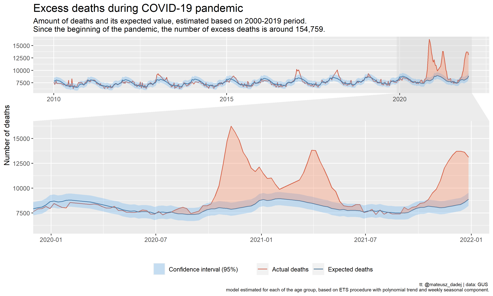
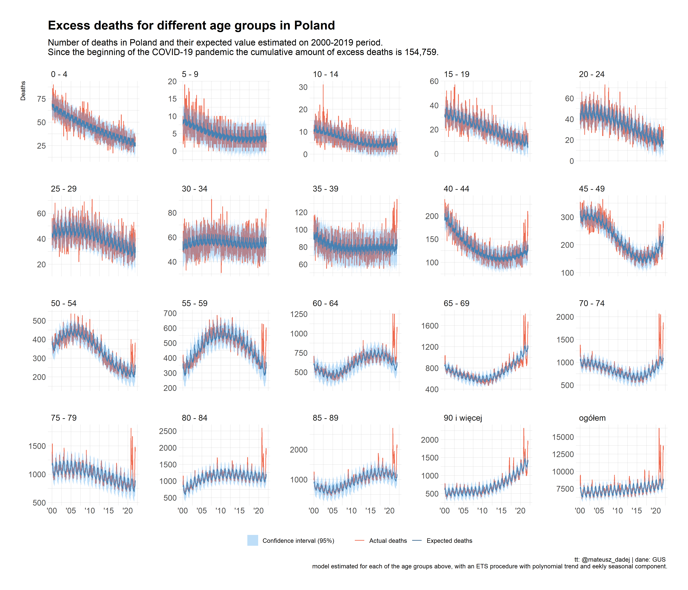
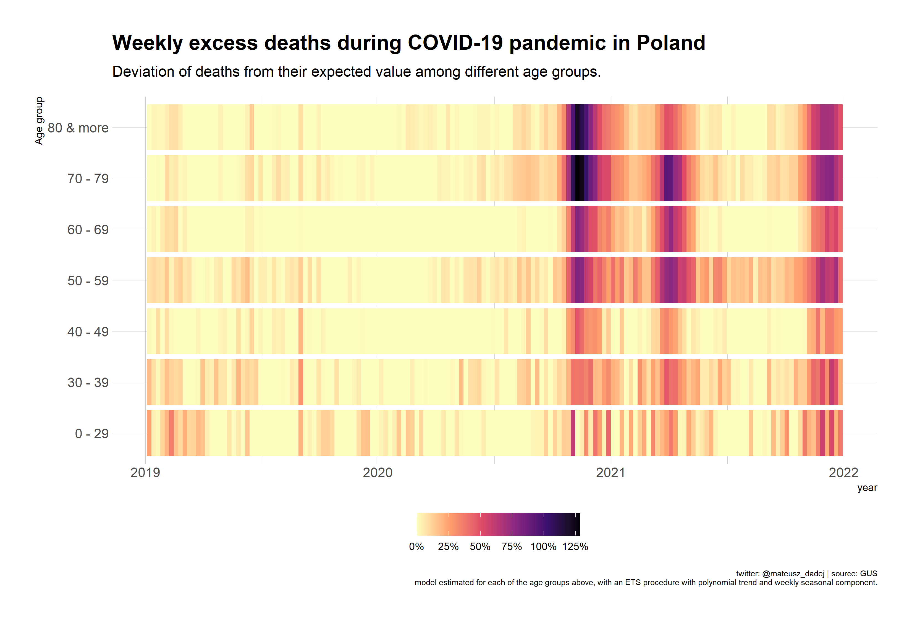

# Excess deaths in Poland
Estimation of excess deaths during COVID-19 pandemic in Poland

As of 22.01.2020, the number of cumulative excess deaths during COVID-19 pandemic is around 154,000. Herein project estimates the number of expected deaths by fitting a model for different age groups with a modified ETS procedure. 

Below are some visualizations of the excess mortality: 

